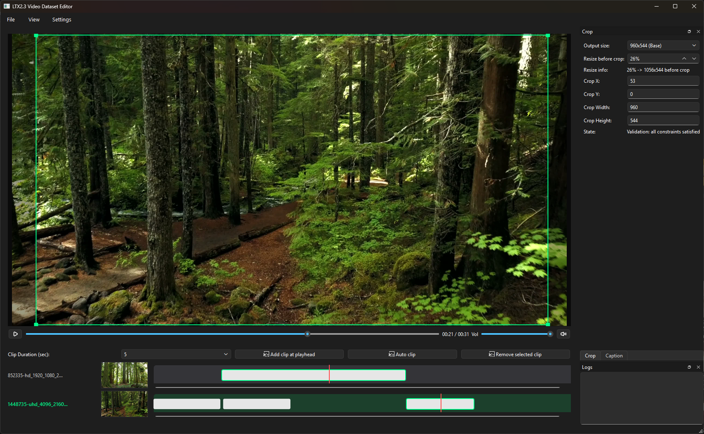

# LTX2.3 Video Dataset Editor



Desktop tool for preparing video datasets for training pipelines.

## What This App Is For

Use this app to quickly prepare many short clips with captions:
- load multiple videos into one project,
- cut clips manually or automatically,
- apply crop/output settings with validation,
- export clips and matching `.txt` captions.

## Main Features

- Multi-video timeline (one row per video).
- Clip durations: `5 / 10 / 15` seconds.
- Export FPS presets based on `8n+1`: `9 / 17 / 25`.
- Global output size with orientation-aware swap (`W x H` or `H x W`).
- Per-video crop position (`x/y`) with visual crop overlay.
- Caption generation via `WD14` or `BLIP2`.
- Batch export for all clips from all videos.
- Save/load project state in one `project.json`.

## Requirements

- Python `3.10+`
- FFmpeg (`ffmpeg.exe` and `ffprobe.exe`)

You can place FFmpeg binaries in local `bin/` or install globally.
Download FFmpeg: [https://ffbinaries.com/downloads](https://ffbinaries.com/downloads)

## Installation

```bash
python -m pip install -r requirements.txt
```

## Run

### Windows

```bat
run_app.bat
```

### Console

```bash
python -m app.main
```

